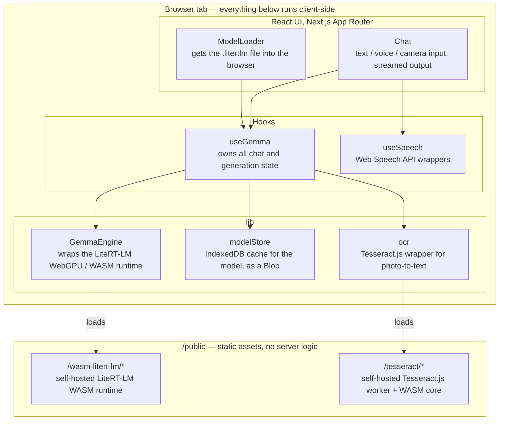
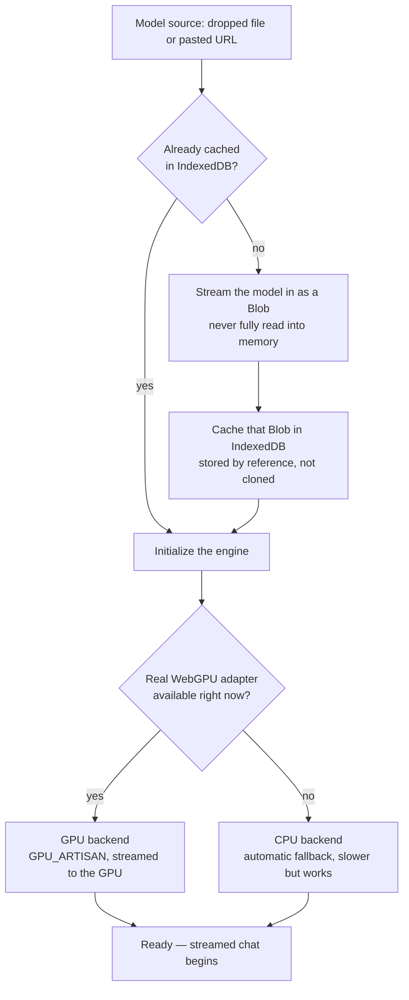
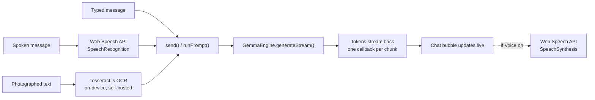

# Meridian

Your world, understood. Even offline.

Meridian is a browser-native AI travel companion built for the Build with Gemma hackathon. The entire model — Gemma 4, the E2B edge-optimized variant — runs inside the browser tab itself via WebGPU. There is no backend, no API key, and no server call for any conversation. Once the model file has been loaded once, the app keeps working with the network disconnected entirely.

This document explains what the app does, how it is built, why specific technical decisions were made (including the ones that were forced by real bugs found during development), and how to run and extend it.

## Table of contents

- What this app does
- Why running Gemma in the browser is the whole point
- Architecture overview
- The model loading pipeline, in detail
- The three input modalities: text, voice, and camera
- Stopping generation mid-stream
- Design system
- Project structure
- Getting started
- Known limitations and honest caveats
- Troubleshooting
- Possible next steps

## What this app does

Meridian is a chat interface to Gemma 4 with three ways to talk to it:

- Type a message, the way you would with any chat app.
- Speak a message using the microphone button. Speech is transcribed to text by the browser's built-in speech recognition, then handled exactly like typed text.
- Photograph a menu, sign, or label with the camera button. The photo is run through on-device OCR, the extracted text becomes the message, and Gemma is asked to translate it and explain what it means for a traveler.

Every one of these paths ends the same way: plain text goes into Gemma 4 running locally, and a streamed text response comes back token by token, rendered live in the chat bubble. Responses can be interrupted mid-stream with a Stop button. If the browser supports text-to-speech, replies can optionally be read aloud automatically.

The whole thing is a single Next.js page. There is no user account, no database, and no analytics. Nothing typed, spoken, or photographed leaves the device.

## Why running Gemma in the browser is the whole point

Most AI travel apps are a thin frontend over a cloud API call. That works fine with good signal, but travelers are exactly the population most likely to be on expensive roaming data, in a subway, or somewhere with no connectivity at all. A cloud-dependent app is unusable in exactly the moment it is needed most.

Meridian's answer is to put the model on the device. Gemma 4's E2B and E4B variants exist specifically for this: small enough to run on a phone or laptop, quantized for edge hardware, and multimodal at the model level (though, as explained below, the browser runtime used here does not yet expose that multimodality — more on that in Known limitations).

The practical proof of this architecture, and the moment worth demoing, is turning off networking entirely after the model has loaded once and continuing to have a full conversation.

## Architecture overview



There is no server-side code that participates in the model pipeline. `next dev` / `next start` exist only to serve the static React app and the static WASM/worker assets — none of them touch the model, the chat, the voice, or the OCR.

## The model loading pipeline, in detail

This is the part of the app that took the most iteration, because it is also the part where a real, hard-to-diagnose bug lived. It is worth explaining properly rather than glossing over. The overall flow, once a file or URL is provided:



The two decision points in this diagram, whether the model is already cached and whether a GPU adapter genuinely works right now, are exactly the two places where naive implementations broke during development. Both are covered in detail below.

### The runtime: LiteRT-LM, not MediaPipe

Google's original browser LLM runtime was the MediaPipe LLM Inference API. That API is now in maintenance mode. The actively developed replacement, and the one Gemma 4's edge builds ship for, is LiteRT-LM, distributed as the `@litert-lm/core` npm package. This is an early-preview package: the README says so directly, and parts of its own source code contain TODO comments acknowledging incomplete paths. That status shaped several decisions below.

`GemmaEngine` in `src/lib/gemma.ts` is the only place in the app that talks to this package. Everything else in the app talks to `GemmaEngine`, not to `@litert-lm/core` directly, so if the underlying library's API changes, there is exactly one file to update.

### Model file format

Gemma 4's browser build ships as a `.litertlm` file, not the `.task` format used by the older MediaPipe runtime. The two are not interchangeable. The correct files for this app are `gemma-4-E2B-it-web.litertlm` (about 2 GB) or `gemma-4-E4B-it-web.litertlm` (larger, more capable, slower) from the `litert-community` organization on Hugging Face. When downloading manually from Hugging Face, the direct download link is the one under Files and versions with a download icon next to the filename — the page you land on by default (the blob/main URL) is an HTML viewer, not the file itself, and does not have the CORS headers needed for the in-app "load from URL" option to fetch it directly. The resolve/main link is the one that works.

### Why the model is handled as a Blob, never as bytes in memory

The first working version of this pipeline read the entire model file into a JavaScript ArrayBuffer, wrote a copy of that buffer into IndexedDB via structured clone, and then wrapped a further copy in a Blob to hand to the engine. For a 2 GB file, that is up to three simultaneous multi-gigabyte allocations in a single browser tab. In practice this reliably crashed the renderer process outright, with Chrome and Edge both reporting the low-level error code STATUS_BREAKPOINT — a hardware-level trap, not a catchable JavaScript exception, which is why the app could not even display an error message when it happened.

The fix, now in place, is to never materialize the model bytes in memory at all:

- A file dropped or selected by the user is already a File, which is already a Blob, which in Chromium is disk-backed rather than memory-backed.
- `modelStore.ts` stores and retrieves that Blob directly in IndexedDB. Browsers store Blob values in IndexedDB by reference to their backing storage, not by cloning their contents, so caching a 2 GB model does not cost 2 GB of RAM.
- `Engine.create()` from `@litert-lm/core` accepts a Blob for its model field directly and streams it internally in chunks.
- When loading from a URL instead of a local file, `blobWithProgress()` in `modelStore.ts` uses the response body's `tee()` method to split the incoming stream in two: one branch is piped straight into building the Blob, the other is only read for its byte count, to drive the progress bar. Byte counting never touches or retains the actual data.

The practical effect: peak additional memory use during a model load is now in the low megabytes, not gigabytes, regardless of model size.

### GPU backend selection and the CPU fallback

LiteRT-LM defaults to a backend called GPU_ARTISAN, which streams the model directly into GPU-managed memory. This app does not override that default when a GPU is available, because it is the most memory-efficient path and, once the Blob-based loading above was fixed, worked reliably.

What it does override is the decision of whether a GPU is available at all, and this needed to be more careful than checking whether navigator.gpu exists. During development, repeated tab crashes caused Chrome and Edge to blocklist the GPU process for the remainder of the browser session — a real, observed behavior, not a hypothetical — and in that state navigator.gpu can still exist as an object while requesting an actual adapter correctly returns nothing. Checking only for the object's existence produced a false positive that then crashed again on the next load attempt.

`detectBackend()` in `src/lib/gemma.ts` performs the real check: it requests an adapter and inspects the result. If no adapter is available, the app falls back to the CPU backend automatically rather than hard-blocking the user with an error. This is slower, but it means the app degrades gracefully instead of becoming unusable after a graphics-layer hiccup. The UI surfaces which backend is active in the chat header at all times.

### The sampler configuration bug

An early version of the code configured Gemma's sampler explicitly, requesting top-k sampling with k equal to 40, a common and reasonable default for LLM generation. The GPU sampler in this early-preview build of LiteRT-LM only supports greedy decoding through this code path and rejected the request outright with an error before generating a single token. The fix was to stop passing custom sampler parameters and rely on the engine's own defaults, matching the reference example in the library's own README. This is very likely a temporary limitation of an early-preview library rather than an intentional restriction, but there was no way to tell without testing against the real runtime, so the pragmatic fix was to stop fighting it.

### Offline asset hosting

Both the LiteRT-LM WASM runtime and the Tesseract.js OCR runtime default to loading their supporting files from public CDNs. For an app whose entire premise is working offline, depending on a CDN for the runtime itself would be a contradiction, so both are self-hosted instead:

- `public/wasm-litert-lm/` contains the four WASM and JS variant pairs LiteRT-LM ships (SIMD and non-SIMD, with and without JSPI support), copied directly from the installed npm package. The app points the runtime loader at this local path instead of the package's CDN default.
- `public/tesseract/` contains Tesseract.js's worker script and its fastest WASM core variant, copied from the installed npm packages.

One caveat is called out explicitly rather than glossed over: Tesseract's actual trained English language data (a separate file from the runtime, roughly one to two megabytes gzipped) is not bundled and still downloads from Tesseract's own CDN the first time OCR runs, cached by the browser's normal HTTP cache after that. Every other part of the app, including the multi-gigabyte language model itself, has zero network dependency after first load. This one auxiliary download was judged not worth the added complexity of also vendoring language training data, since OCR is a secondary feature layered on top of the core offline chat experience, not the feature the offline story is built around.

### Caching and the offline story in practice

The first time a model is loaded, whether from a local file or a URL, its bytes are cached as a Blob in IndexedDB under a key derived from the file's name, size, and modification time for local files, or its source URL for remote ones. Every subsequent visit checks this cache first. If it is a cache hit, the multi-gigabyte download or file-read step is skipped entirely and the app proceeds straight to initializing the WebGPU engine. This is what makes the "turn off networking and keep talking to Gemma" demo moment actually work, rather than being true only in theory.

## The three input modalities: text, voice, and camera

All three paths converge on the same text pipeline. Gemma only ever sees plain text; it never knows or needs to know whether that text was typed, spoken, or read off a photograph.



### Text

The default path. A message is typed, submitted, appended to the chat as a user message, and handed to the engine's streaming generation call, which streams tokens back through a callback that updates the last message in the list on every chunk.

### Voice, the Babel feature

Gemma 4 the model can accept audio input at the model level, but the LiteRT-LM JavaScript runtime used here is early-preview and does not expose that yet — its own type definitions mark image and audio content parts as placeholders, explicitly commented as not supported in JavaScript. Rather than wait on that, voice input and output are built entirely with the browser's native Web Speech API, which needs no model-level audio support at all:

- A speech recognition hook in `src/hooks/useSpeech.ts` wraps the browser's SpeechRecognition interface, falling back to the WebKit-prefixed version for Chrome and Edge. Tapping the microphone button starts listening; when a final transcript is produced, it is sent through the exact same send path as typed text. Gemma never knows whether a message was typed or spoken, because by the time it sees the message, it is plain text either way.
- A speech synthesis hook wraps the browser's speechSynthesis interface. A Voice on toggle in the chat header, when enabled, speaks each completed assistant response aloud automatically as soon as generation finishes.

Both hooks feature-detect the relevant browser APIs and hide themselves gracefully, the mic button and voice toggle simply do not render, on browsers that lack support, rather than showing a broken control.

### Camera, the Lens feature

For the same reason as above, true visual scene understanding, pointing a camera at a landmark and asking Gemma to identify it, is not available through this runtime today. What is fully achievable, and implemented, is optical character recognition: photographing text-bearing objects like menus, signs, and instructions, and having Gemma translate and explain the extracted text.

The pipeline lives in `src/lib/ocr.ts` and the useGemma hook's sendImage function:

1. The camera button opens the device camera or a file picker, using the file input's capture attribute, which prompts most mobile browsers to open the rear camera directly.
2. The captured image is handed to a self-hosted Tesseract.js worker running entirely client-side.
3. The raw extracted text is what appears in the user's chat bubble, so it is clear exactly what was read from the photo.
4. A separate, wrapped prompt, the extracted text plus an instruction to translate it if needed and explain its relevance to a traveler, is what actually goes to Gemma. The user sees the clean extracted text; the model sees the full instruction.

If OCR finds no readable text, a blurry photo, or a photo of a landscape with no signage, the app says so directly rather than sending an empty or nonsensical prompt to the model.

## Stopping generation mid-stream

Long responses can be interrupted. While a response is streaming, the Send button becomes a Stop button. Clicking it signals the underlying LiteRT-LM conversation object to cancel, which ends the generation loop. The partial text already streamed to the chat bubble is preserved rather than discarded, with a stopped marker appended so it is visually distinguishable from a response that finished on its own. The input field, microphone, and camera controls become available again immediately.

## Design system

The visual language, referred to internally as Atlas Noir, is a deliberate departure from the generic AI chat app look:

- A deep ink background rather than pure black or white, with warm off-white text.
- A single accent used exclusively for AI-related moments: a teal-to-violet aurora gradient, applied to the app's wordmark, the pulsing status orb next to Gemma's name, and progress bars during model loading. The intent is that this gradient becomes visually synonymous with the model being active, and appears nowhere else in the UI.
- An editorial serif typeface, Fraunces, for the wordmark and section headings, paired with a clean grotesk, Geist, for interface text, a contrast borrowed from print and travel-magazine design rather than typical SaaS dashboards.
- Glass-panel surfaces: semi-transparent, blurred panels that float over the plain background, with a single hairline border rather than heavy drop shadows.
- Status is always visible, never hidden behind a spinner with no explanation: the chat header always states whether Gemma is idle, thinking, or reading a photo, and which backend, WebGPU or CPU, is currently active.

All of this lives in `src/app/globals.css` as CSS custom properties and utility classes, plus the Tailwind v4 theme block that exposes those properties as Tailwind color tokens.

## Project structure

```
src/
  app/
    layout.tsx        Root layout: fonts, metadata, dark theme class
    page.tsx           Top-level page: wires useGemma into ModelLoader / Chat
    globals.css         Atlas Noir design tokens and utility classes
  components/
    ModelLoader.tsx      Model file intake: drag-and-drop, file picker, URL, progress
    Chat.tsx              Chat UI: messages, text input, mic, camera, stop, voice toggle
  hooks/
    useGemma.ts           All chat/generation state; the only thing page.tsx talks to
    useSpeech.ts           Web Speech API wrappers (recognition + synthesis)
  lib/
    gemma.ts               GemmaEngine: the only file that imports @litert-lm/core
    modelStore.ts            IndexedDB Blob cache + streaming-with-progress helper
    ocr.ts                    Tesseract.js wrapper for photo-to-text
public/
  wasm-litert-lm/             Self-hosted LiteRT-LM WASM runtime, four variant pairs
  tesseract/                   Self-hosted Tesseract.js worker and WASM core
```

## Getting started

Requirements: Node.js 22 or later, and a browser with WebGPU support, a recent desktop Chrome or Edge. The CPU fallback works everywhere else, more slowly. A .litertlm build of Gemma 4 is not bundled with this repository, it is a multi-gigabyte file distributed separately on Hugging Face.

Install dependencies and start the dev server:

```
npm install
npm run dev
```

Open localhost:3000. On first load, either drag a downloaded gemma-4-E2B-it-web.litertlm file onto the drop zone, or paste a direct Hugging Face resolve/main download link into the URL field, not the blob/main viewer link, see the model loading section above for why that distinction matters. The first load will take a while, proportional to the file's size and your connection speed. Every subsequent load, even after closing the tab or restarting the browser, will be near-instant, because the model is cached in IndexedDB.

To type-check and lint the project without starting the dev server:

```
npx tsc --noEmit
npm run lint
```

## Known limitations and honest caveats

Written deliberately in plain terms, because a project like this is more credible when its limitations are stated rather than discovered by a judge or user:

- @litert-lm/core is an early-preview package. Its own README says so. Behavior, APIs, and performance characteristics may change in future versions, and some rough edges, like the sampler restriction described above, are a direct consequence of that maturity level, not a design choice made in this app.
- Image and audio are not accepted as model input through this runtime yet, even though Gemma 4 supports both at the model level. Lens is implemented as OCR-then-text rather than true visual understanding, which is why it handles menus and signs well but cannot, for example, identify a landmark from a photo or describe a scene with no text in it.
- Voice input and output depend entirely on the Web Speech API, which is a browser feature, not a Gemma capability, and its quality and language support vary by browser and operating system.
- Tesseract's English language training data is fetched from a CDN on its first use only, it is the one piece of the app with any network dependency, and only on a machine's very first photo scan.
- WebGPU availability can be disabled by the browser itself after repeated GPU-process crashes, persisting until every browser window is closed and reopened. This is standard browser behavior, not specific to this app, but it was directly responsible for the hardest bug encountered during development and is worth knowing about if generation ever seems to silently fall back to a much slower CPU mode.
- A roughly 2 GB, or larger for E4B, file download is required before the app is usable for the first time. This is an inherent cost of true on-device inference and is the tradeoff being made deliberately in exchange for offline capability afterward.

## Troubleshooting

The chat header says CPU instead of WebGPU, and generation is slow. This means no WebGPU adapter was available when the model loaded, most often because the browser's GPU process was previously blocklisted after a crash. Fully close every window of the browser, not just the tab, reopen, and try loading again.

Loading from a URL fails with a CORS error in the console. The URL is almost certainly a Hugging Face blob/main viewer link rather than a resolve/main direct download link. Only the latter serves the raw file with the CORS headers needed for cross-origin fetches from a page running on a different origin.

The model file loaded once but has to be re-downloaded after a browser restart. IndexedDB storage can be cleared by private or incognito mode, by the browser's own storage-pressure eviction, or by a user manually clearing site data. This is expected: the cache is best-effort, not a guarantee, and the app is designed to still function, just slower, needing a fresh download, if the cache is unavailable for any reason.

## Possible next steps

Things that were deliberately scoped out of this build but would be natural extensions: a boost mode that hands off to a larger Gemma 4 build on a server when online, for deeper itinerary planning than the on-device model comfortably handles; true visual scene understanding once LiteRT-LM's JavaScript runtime adds image support; an installable PWA manifest and service worker so the app can be launched like a native app and its own UI shell, not just the model, is cached offline; and multi-turn conversation memory across sessions, currently reset on every page reload.
